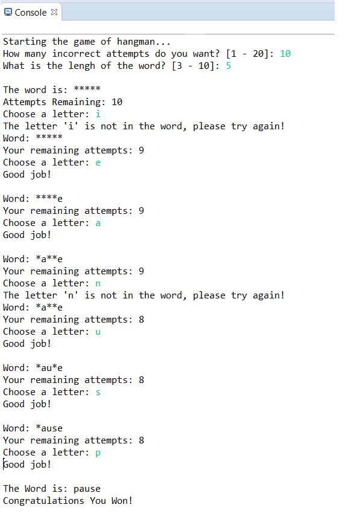

# hangman

<h4>Is a guessing game. The player would try to guess a letter in the word within a certain number of guesses.  
The user have the ability to choose how many guesses he/she needs to solve the game.  
The user have the ability to choose the length of the word, the range is from [3 letters - 10 letters]  
If the letter is contained in the word, the user takes another turn guessing a letter.  
It doesn't going to count from the user's attempts since it has been a correct guess.  
If the letter is not contained in the word, the number of attempts would be decreased by one.   
The game continues until:  
&nbsp;&nbsp;&nbsp;&nbsp;&nbsp;&nbsp;1. The word has been guessed ( all letters are revealed) - WINNER  
&nbsp;&nbsp;&nbsp;&nbsp;&nbsp;&nbsp;2. The number of attempts remaining reached zero and the word/part of the word not revealed. - LOSER  
</h4>

